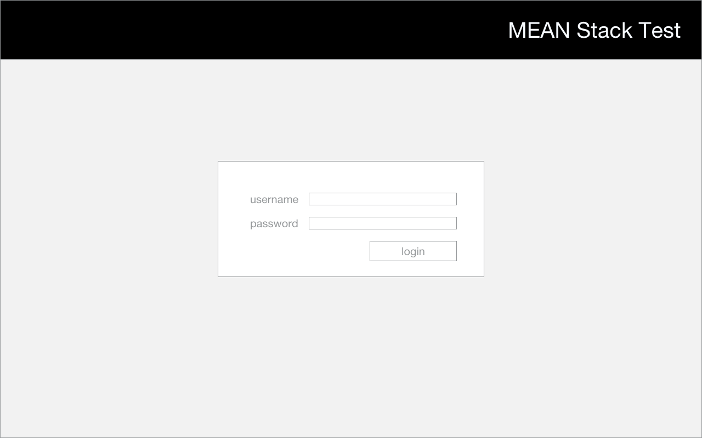
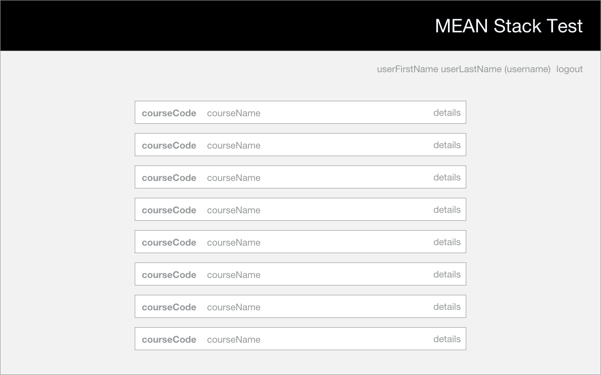
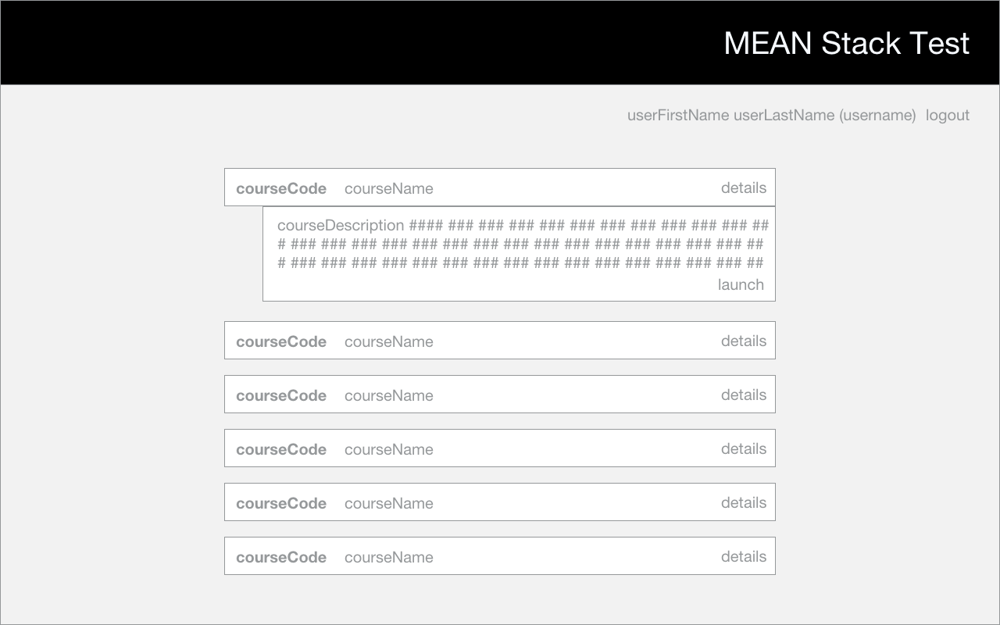
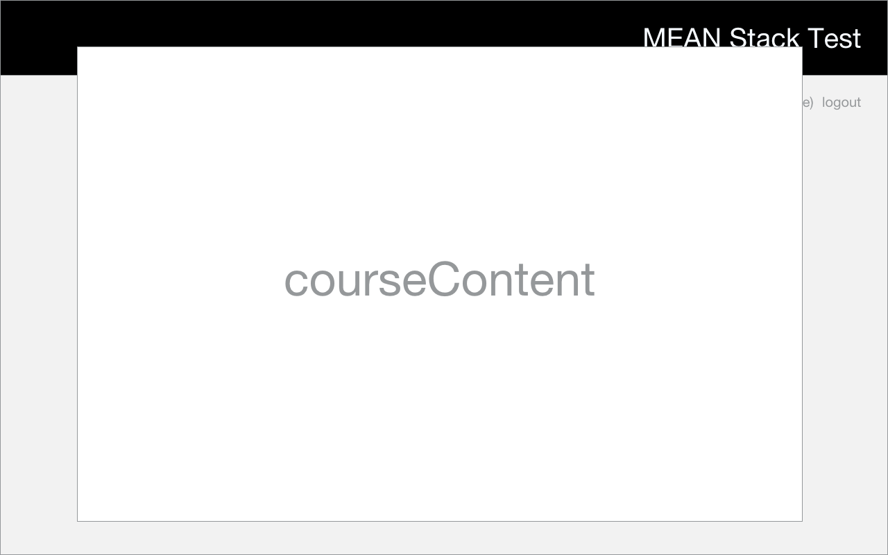

#MEAN Stack Test

##Main objective:
This project is a test for new hires at SHIFT eLearning and Aura Interactiva.
You will be asked to develop a small MEAN Stack based application, and upload it
to GitHub.

##Technologies used:
- MEAN Stack. MongoDB, Express.js, Angular.js and Node.js.
- HTML5, Javascript, CSS, jQuery.
- Git.

##Points of interest:
Amongst the points evaluated in this project are:
- Ability to read English language documentation.
- Fluency in all the technologies used.
- Ability to follow steps and provide the desired final product.
- Quality of code and clarity in final result.

##Base project structure:
- `/README.md`: This file.
- `/package.json`: Node.js package file.
- `/server.js`: Application start file.
- `/public/`: Public directory.
- `/public/views`: Views directory. All views must be located there.
- `/public/js`: Angular directory. All angular components (controllers, services,
  etc) must be located there.
- `/config/`: Configuration files directory.
- `/app/`: Application components.
- `/app/routes/`: Express routes definitions.
- `mongoexport`: Sample data files. Users and Courses. Users is a simple list of
  system users; Courses is a list of courses, each with an array of users that
have access to them.
- `mockups`: GUI mockup images.

##Requirements:
1. All communication should be made through email. If you have any question,
  comment, or when you have finished your final result, please email your
contact or contacts.
2. You can use any editor, IDE or development environment, as long as it generates
plain and readable HTML, CSS and Javascript files. Vim is suggested, but not
necessary.
3. You will need to place the final product of your previous test (FW6 based content), inside the `/public/content/` directory.
4. Import the files inside `/mongoexport` into a MongoDB database. Use the same
   file name as the collection name (users, courses). Name the database
`meanstacktest`.
5. There are mockups for each screen. You should implement your interfaces based
   on them. 
6. All server side components should be implemented using Node.js and
   Express.js.
7. All frontend components should be implemented using Angular.js.

##Expected behaviour:
1. The application should start with a login screen, and block any other actions, if the user is not
logged in. 
2. After logging in, the user should see a list of only the courses she has access
   to. That list must show the courses' code, and name. This screen also must show a link to log out. 
3. When the user clicks a row of that list, the system should show the course's
   details: its description, and a link to launch it. Steps 2 and 3 must happen
on the same view. 
4. When the user clicks the link to launch the course, the system should open a
   new window, with the corresponding content. Notice that all courses point to
the same content (your results for the previous test).

